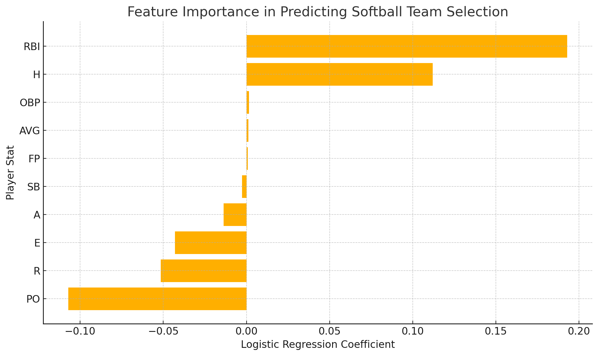

# softball-team-prediction
Predicting varsity softball team selection using logistic regression and player stats from MaxPreps.

## 📂 Data Source

Stats were pulled from [MaxPreps](https://www.maxpreps.com/) for top-performing high school players:
- Kennedy Bradley – Melissa Cardinals Varsity (TX)
- Katie King – Orange Beach Makos (AL)
- Meagan Villazon – Doral Academy Firebirds (FL)

Three simulated players who did **not** make the team were added to balance the dataset.

## 🧠 Method

- Logistic Regression (scikit-learn)
- Features: Batting Average, On-Base %, Hits, RBI, Errors, Fielding %, etc.
- Target: `Made_Team` = 1 (yes) or 0 (no)

## 📊 Key Insight

- **RBI (Runs Batted In)** and **Hits** were the strongest predictors of success
- **Errors**, **Put Outs**, and **Runs Scored** reduced the likelihood of making the team

## 🖼️ Feature Importance Chart

## 🛠️ Tools

- Python (Google Colab)
- scikit-learn
- pandas
- matplotlib

